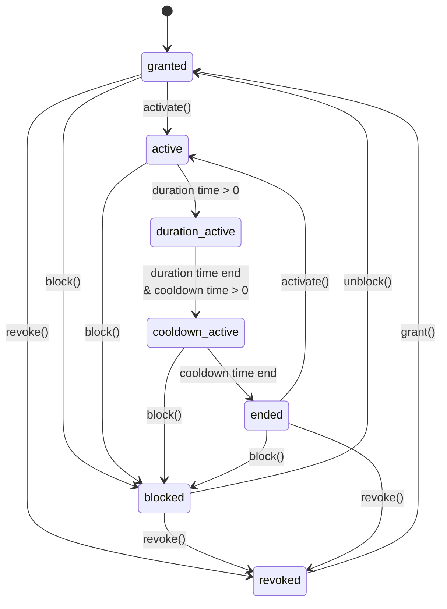
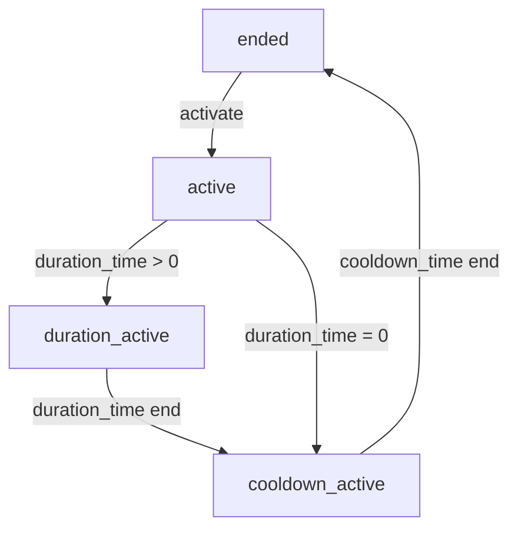
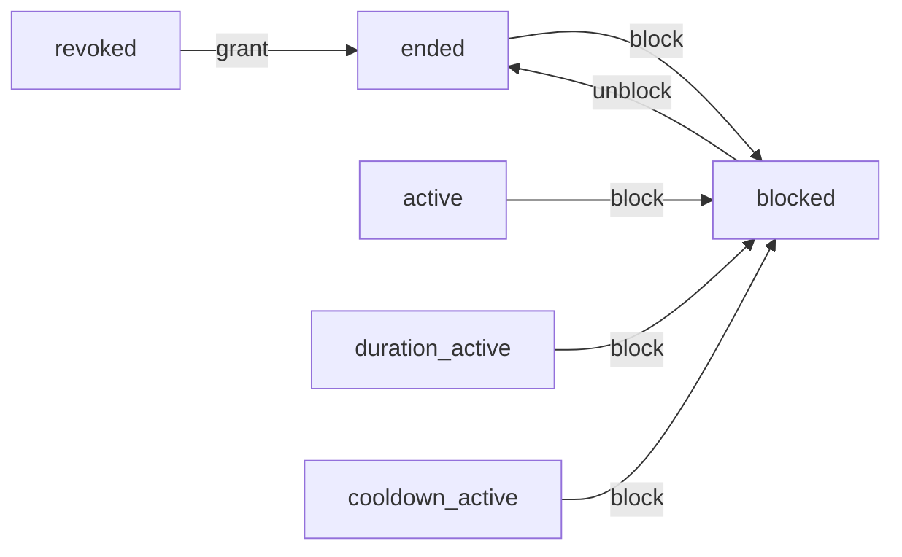

# `godot-gameplay-abilities` Plugin Documentation

## Core Concepts

- `Ability`: A single ability that can be activated, granted, revoked, etc. Works like a blueprint of an ability.
- `AbilityContainer`: A container that holds abilities. It can be attached to any node in the scene.
- `RuntimeAbility`: The runtime representation of an ability. It is created when an ability is added to an `AbilityContainer`.

## Designing Abilities by Extending the Ability Script

### Ability States

#### Classification

Logically, abilities can be divided into the following states:
- **granted**: The ability has been granted to the container and is available.
  - **ended**: A stable state after the ability has finished execution. The ability is also in this state when first granted but not yet activated (i.e., the *initial state*).
  - **active**: The ability is currently being executed.
    - **duration_active**: The duration period after the ability is activated.
  - **cooldown_active**: The cooldown phase after the ability is used.
  - **blocked**: The ability is temporarily disabled. By default, the cooldown and duration are reset to 0.0.
- **revoked**: The ability has been revoked and must be granted again to be used.

#### Transitions

- State Transition Diagram:


- Activation State Cycle:


- Blocked State Cycle:


### Ability Implementation: Overriding the Ability Class

The `Ability` class provides several types of virtual methods that can be overridden as needed. Before overriding, it's important to understand their purposes and the implications of overriding:
- `_can_*`: Condition checks that determine whether an operation is allowed.
- `_should_*`: Behavioral judgments that determine whether certain actions should be automatically performed (e.g., auto-activation, auto-ending).
- `_on_*`: Event callbacks that execute custom logic when the state changes.
- `_get_*`: Getter methods for cooldown and duration properties.

#### `_can_*` Methods

`_can_*` methods perform **condition validation** before any state transition to determine whether an operation is allowed. Overridden methods should return a boolean indicating whether the condition is met. If not overridden, no condition check is performed (equivalent to returning `true` by default).
- `_can_activate_cooldown`: Checks if the cooldown can be started.
- `_can_be_activated`: Checks if the ability can be activated.
- `_can_be_blocked`: Checks if the ability can be blocked.
- `_can_be_ended`: Checks if the ability can be ended.
- `_can_be_granted`: Checks if the ability can be granted.
- `_can_be_revoked`: Checks if the ability can be revoked.

#### `_should_*` Methods

`_should_*` methods implement **automated state management** by checking if a state transition should be triggered at specific times.

| Method                  | Call Timing                   | Frequency       | Function Description                             | Default Return Value |
|-------------------------|-------------------------------|-----------------|--------------------------------------------------|----------------------|
| `_should_be_activated`  | `handle_tick()`               | On ability add + every frame | Checks if the ability should be auto-reactivated | `false`              |
| `_should_be_blocked`    | `handle_tick()`, `activate()`, `unblock()` | Every frame + on activation + on unblocking | Checks if the ability should enter the blocked state | `false` |
| `_should_be_ended`      | `handle_tick()`               | Every frame     | Checks if the ability should end                | `true`               |
| `_should_reset_cooldown`| `block()`, `end()`            | During state transitions | Determines if the cooldown should be reset       | `cooldown time != 0` |
| `_should_reset_duration`| `block()`, `end()`            | During state transitions | Determines if the duration should be reset       | `true`               |

Note: When the container calls `add_ability`, it automatically checks if the ability needs to be activated.

#### `_on_*` Methods

`_on_*` methods provide event hooks that allow developers to execute custom logic when an ability's state changes.

| Method         | Call Timing                     | Primary Purpose                                                                 |
|----------------|---------------------------------|---------------------------------------------------------------------------------|
| `_on_activate` | After the ability is successfully activated | Execute activation logic (play effects, apply buffs, etc.)                     |
| `_on_block`    | After the ability is blocked    | Handle blocking state (show disabled icon, interrupt channeling, etc.)         |
| `_on_end`      | After the ability normally ends | Clean up skill effects (remove buffs, calculate damage, etc.)                  |
| `_on_grant`    | When the ability is granted     | Initialize the skill (load resources, register listeners, etc.)                |
| `_on_revoke`   | When the ability is revoked     | Fully clean up the skill (release resources, remove states, etc.)              |
| `_on_tick`     | Every `physics` frame update (`handle_tick()`) | Implement fully custom ability logic, overriding default mechanisms           |

- **Note**:
  - **Caution:override `_on_tick`**: Overriding this method completely disables default duration and cooldown mechanisms, as well as per-frame `_should_*` checks!
  - **Avoid recursive calls**: Do not trigger the same event in callback methods (e.g., calling `activate` in `_on_activate`), which may cause infinite recursion.
  - **State safety**: Be aware of the ability's possible states in callback methods. For example, in `_on_end`, the ability is about to enter the ended state, so activation attempts should be avoided.
    - Additionally, the ability's state in callback methods is still the previous state, not yet fully transitioned.

#### `_get_*` Methods

Dynamically retrieve the ability's cooldown and duration. When the ability is activated, `_get_cooldown` and `_get_duration` are called to obtain these values.

## Using Abilities with the `AbilityContainer` Class

The `AbilityContainer` class manages a collection of abilities and provides methods to operate on them.

#### Ability Management: Add, Remove, Modify, Query

| Method Signature | Return Type | Method Description |
|------------------|-------------|--------------------|
| `add_ability(ability: Ability)` | `bool` | Adds an ability resource to the container. Automatically calls:<br> - `try_grant(ability)`<br> - If the ability is granted and `should_be_activated`, calls `try_activate(ability)` |
| `find_ability(predicate: Callable) const` | `RuntimeAbility` | Finds an ability in the container by calling a predicate function |
| `get_runtime_abilities() const` | `Array[RuntimeAbility]` | Gets all runtime ability instances |
| `get_runtime_ability(ability_name_or_instance: Variant) const` | `RuntimeAbility` | Gets the ability by name or instance |
| `has_ability(ability_name_or_instance: Variant) const` | `bool` | Checks if the container has the specified ability (parameter can be ability name or instance) |
| `remove_ability(ability: Ability)` | `bool` | Ends the ability if active, revokes it, and removes the ability resource from the container |

#### Ability State Checks

| Method Signature | Return Type | Method Description |
|------------------|-------------|--------------------|
| `is_ability_active(ability_name_or_instance: Variant) const` | `bool` | Checks if the specified ability is active |
| `is_ability_blocked(ability_name_or_instance: Variant) const` | `bool` | Checks if the specified ability is blocked |
| `is_ability_cooldown_active(ability_name_or_instance: Variant) const` | `bool` | Checks if the specified ability's cooldown is active |
| `is_ability_ended(ability_name_or_instance: Variant) const` | `bool` | Checks if the specified ability has ended |
| `is_ability_granted(ability_name_or_instance: Variant) const` | `bool` | Checks if the specified ability has been granted |

#### Ability Operations

| Method Signature | Return Type | Method Description |
|------------------|-------------|--------------------|
| `try_activate(ability_or_ability_name: Variant) const` | `abilities.AbilityEventType` | Tries to activate the ability. If `_try_activate` is overridden, its logic controls activation. Emits `ability_activated` signal on success |
| `try_block(ability_or_ability_name: Variant) const` | `abilities.AbilityEventType` | Tries to block the ability. If `_try_block` is overridden, its logic controls blocking. Emits `ability_blocked` signal on success |
| `try_end(ability_or_ability_name: Variant) const` | `abilities.AbilityEventType` | Tries to end the ability. If `_try_end` is overridden, its logic controls ending. Emits `ability_ended` signal on success |
| `try_grant(ability_or_ability_name: Variant) const` | `abilities.AbilityEventType` | Tries to grant the ability. If `_try_grant` is overridden, its logic controls granting. Emits `ability_granted` signal on success |
| `try_revoke(ability_or_ability_name: Variant) const` | `abilities.AbilityEventType` | Tries to revoke the ability. If `_try_revoke` is overridden, its logic controls revocation. Emits `ability_revoked` signal on success |
| `try_unblock(ability_or_ability_name: Variant) const` | `abilities.AbilityEventType` | Tries to unblock the ability. Emits `ability_unblocked` signal on success |


## Practical Applications

### Ability Design Example: Creating an Ability that Triggers Actions at Intervals During Its Duration

This example uses Tween to achieve the effect. Theoretically, you could also override `_on_tick`, but this would disrupt default logic:

```gdscript
extends Ability
class_name TweenIntervalTriggeringAbility

## Ability that triggers at regular intervals using Tween

# Ability name
const ABILITY_NAME := "TweenIntervalTriggeringAbility"

var ability_tween: Tween
var cooldown_time := 2.0
var duration_time := 5.0
var set_delay_time := 1

func _init(_ability_name = ABILITY_NAME):
	ability_name = _ability_name
	print(ABILITY_NAME + "::_init - ability_name: %s" % ability_name)

# Get ability cooldown time
func _get_cooldown(_ability_container: AbilityContainer) -> float:
	print(ABILITY_NAME + "::_get_cooldown - return: %s" % cooldown_time)
	return cooldown_time

# Get ability duration
func _get_duration(_ability_container: AbilityContainer) -> float:
	print(ABILITY_NAME + "::_get_duration - return: %s" % duration_time)
	return duration_time

# Called when the ability is granted
func _on_grant(_ability_container: AbilityContainer, _runtime_ability: RuntimeAbility) -> void:
	print(ABILITY_NAME + "::_on_grant ")

var test_print_times := 0
# Called when the ability is activated
func _on_activate(ability_container: AbilityContainer, runtime_ability: RuntimeAbility) -> void:
	print(ABILITY_NAME + "::_on_activate ")
	if ability_tween:
		ability_tween.kill()
	@warning_ignore("narrowing_conversion")
	ability_tween = ability_container.create_tween().set_loops(duration_time/set_delay_time)
	ability_tween.tween_callback(
		func():
			print("ability_container.get_runtime_abilities(): ", ability_container.get_runtime_abilities())
			print("runtime_ability.is_active(): ", runtime_ability.is_active())
			test_print_times += 1
			print("Interval Triggering %s" % test_print_times)
	).set_delay(set_delay_time)

# Called when the ability is blocked
func _on_block(_ability_container: AbilityContainer, _runtime_ability: RuntimeAbility) -> void:
	print(ABILITY_NAME + "::_on_block ")
	if ability_tween:
		ability_tween.kill()

# Called when the ability ends
func _on_end(_ability_container: AbilityContainer, _runtime_ability: RuntimeAbility) -> void:
	print(ABILITY_NAME + "::_on_end ")
	if ability_tween:
		ability_tween.kill()

# Called when the ability is revoked
func _on_revoke(_ability_container: AbilityContainer, _runtime_ability: RuntimeAbility) -> void:
	print(ABILITY_NAME + "::_on_revoke ")
	if ability_tween:
		ability_tween.kill()
```

### Ability Container Usage Example

```gdscript
extends Node
func _ready() -> void:
	# Add ability
	var test_ability = TweenIntervalTriggeringAbility.new()
	var container = AbilityContainer.new()
	add_child(container)
	container.add_ability(test_ability)

	# Activate ability
	container.try_activate(test_ability.ABILITY_NAME)

	# Check ability state
	if container.is_ability_active(test_ability.ABILITY_NAME):
		print("Ability is active")
		
	# Remove ability
	container.remove_ability(test_ability)
```

### Ability Template Reference

```gdscript
class_name BaseAbility extends Ability

# Ability name (should be unique)
const ABILITY_NAME := "BaseAbility"

#region Initialization methods
func _init(_ability_name = ABILITY_NAME):
    ability_name = _ability_name
#endregion

#region Event callback methods
# These methods are called when the state changes

func _on_activate(_ability_container: AbilityContainer, _runtime_ability: RuntimeAbility) -> void:
    # Logic when the ability is activated
    # Typically execute the main effect of the ability here
    pass

func _on_block(_ability_container: AbilityContainer, _runtime_ability: RuntimeAbility) -> void:
    # Logic when the ability is blocked
    # Typically interrupt the ability effect here
    pass

func _on_end(_ability_container: AbilityContainer, _runtime_ability: RuntimeAbility) -> void:
    # Logic when the ability ends
    # Typically clean up the ability effect here
    pass

func _on_grant(_ability_container: AbilityContainer, _runtime_ability: RuntimeAbility) -> void:
    # Logic when the ability is granted
    # Typically initialize the ability here
    pass

func _on_revoke(_ability_container: AbilityContainer, _runtime_ability: RuntimeAbility) -> void:
    # Logic when the ability is revoked
    # Typically perform complete cleanup of the ability here
    pass
#endregion


#region Condition check methods
# These methods determine whether state transitions are allowed

func _can_activate_cooldown(_ability_container: AbilityContainer, _runtime_ability: RuntimeAbility) -> bool:
    # Default: Always allow cooldown activation
    return true

func _can_be_activated(_ability_container: AbilityContainer, _runtime_ability: RuntimeAbility) -> bool:
    # Default: Always allow ability activation
    return true

func _can_be_blocked(_ability_container: AbilityContainer, _runtime_ability: RuntimeAbility) -> bool:
    # Default: Always allow ability blocking
    return true

func _can_be_granted(_ability_container: AbilityContainer, _runtime_ability: RuntimeAbility) -> bool:
    # Default: Always allow ability granting
    return true

func _can_be_revoked(_ability_container: AbilityContainer, _runtime_ability: RuntimeAbility) -> bool:
    # Default: Always allow ability revocation
    return true

func _can_be_ended(_ability_container: AbilityContainer, _runtime_ability: RuntimeAbility) -> bool:
    # Default: Always attempt to end (if conditions permit)
    return true
#endregion

#region Property retrieval methods
# These methods provide dynamic properties of the ability

func _get_cooldown(_ability_container: AbilityContainer) -> float:
    # Default: No cooldown time
    return 0.0

func _get_duration(_ability_container: AbilityContainer) -> float:
    # Default: No duration
    return 0.0
#endregion

#region Automatic state management methods
# These methods implement automated state management

func _should_be_activated(_ability_container: AbilityContainer) -> bool:
    # Default: Do not auto-activate
    return false

func _should_be_blocked(_ability_container: AbilityContainer) -> bool:
    # Default: Do not auto-block
    return false

func _should_be_ended(_ability_container: AbilityContainer) -> bool:
    # Default: Always try to end (if conditions allow)
    return true
#endregion

#region Methods for cautious use
# Override this method with caution
# Overriding this method transfers full control of ticking behavior to the implementer, bypassing the ability system's duration/cooldown handling and resulting in no calls to the per-frame `_should_*` method checks.
#func _on_tick(delta: float, cooldown_time: float, ability_container: AbilityContainer, runtime_ability: RuntimeAbility) -> void:
    #pass
#endregion
```
